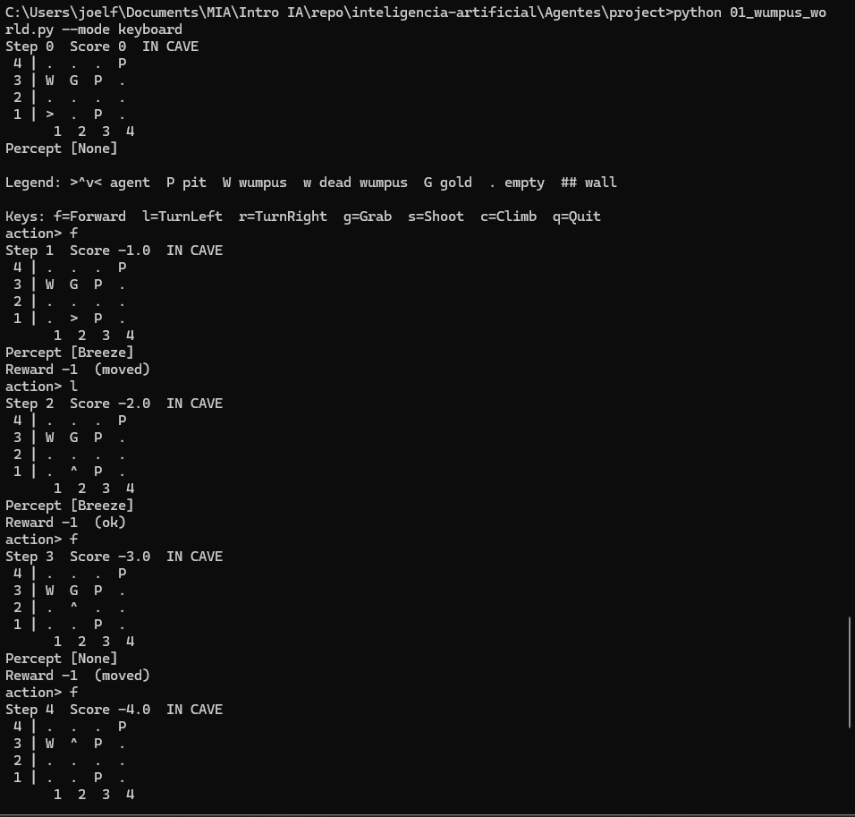

# Agentes Ejercicio 1
## Joel Cristoper Flores Escalante

### Ejecución de "python 01_wumpus_world.py --mode keyboard"
En este paso jugue con el mapa de wumpus que nos genera la configuración. Y se logró cazar al Wumpus y agarrar el oro. Como se muestra en las capturas de pantalla:

