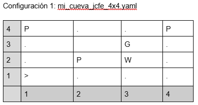
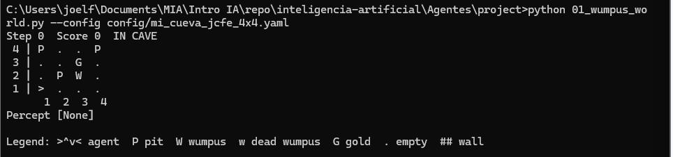
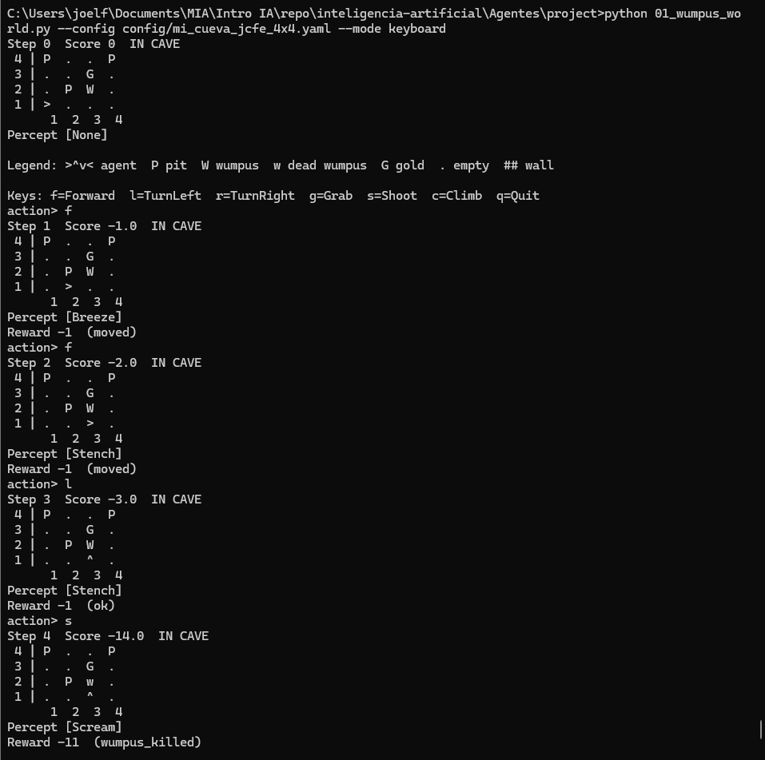
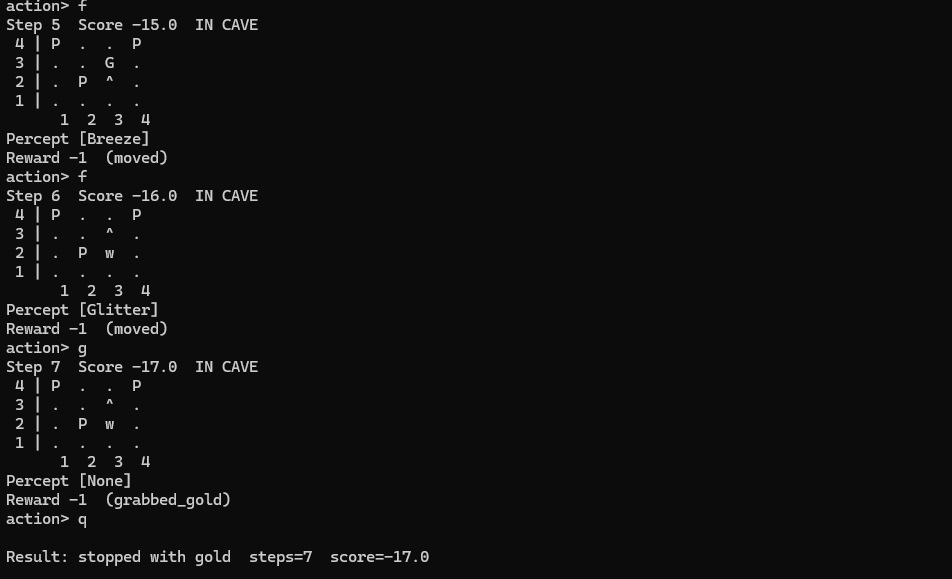
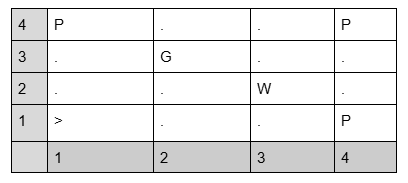
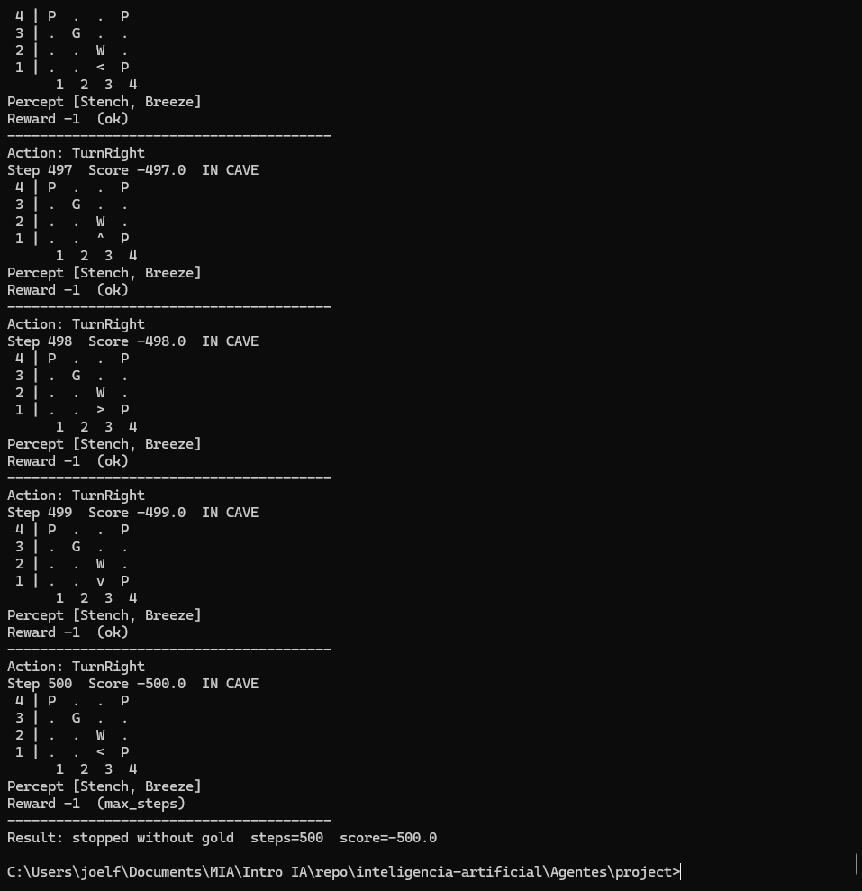
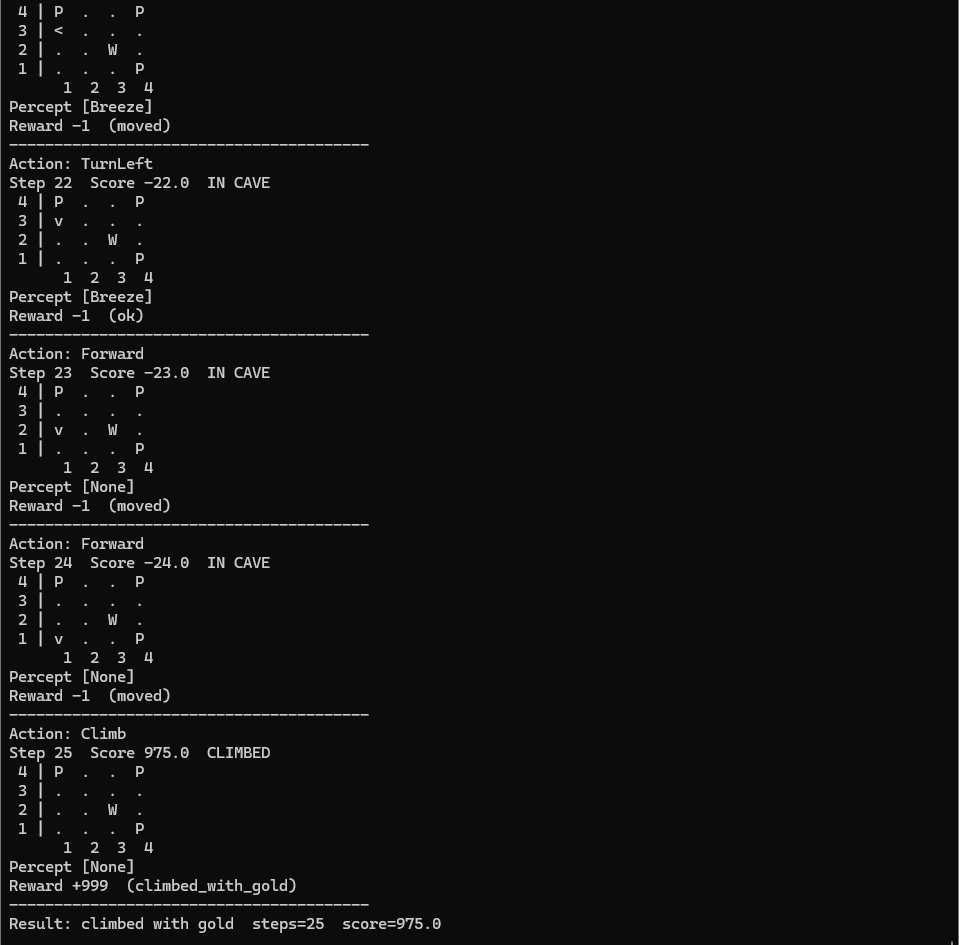
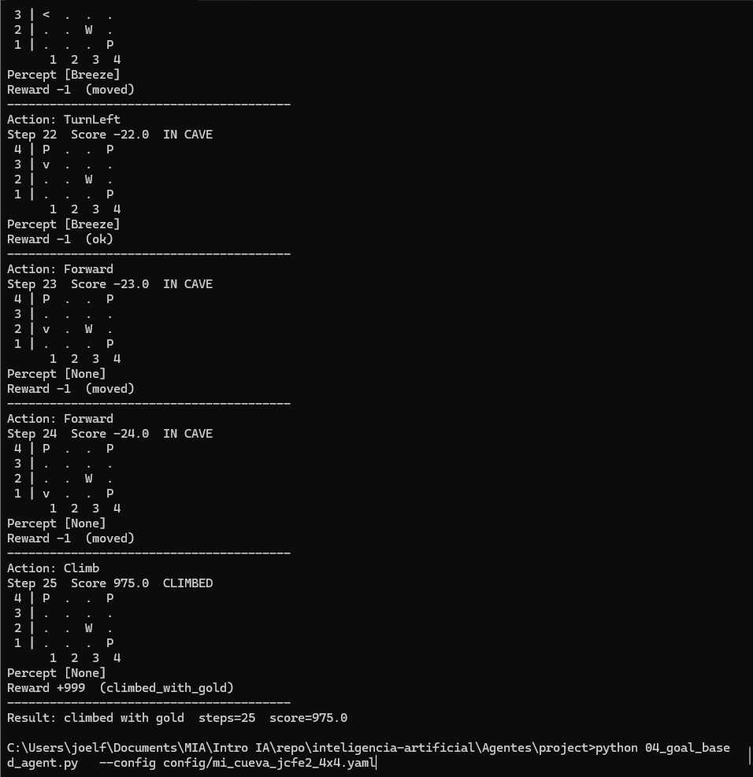
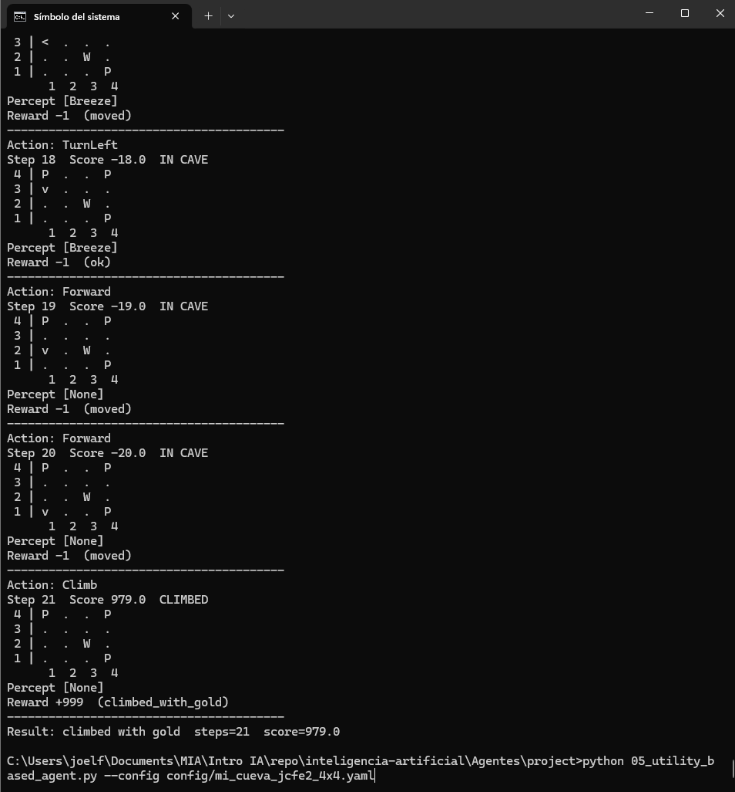
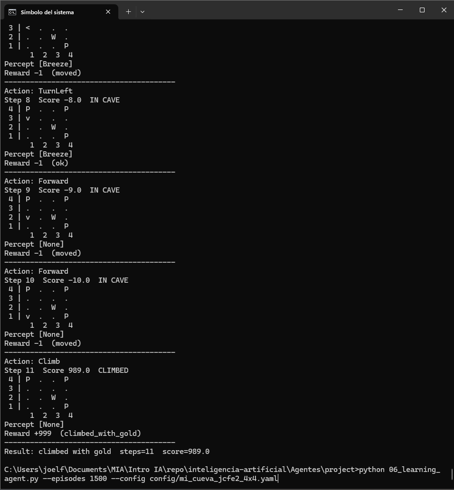

# Agentes Ejercicio 1
## Joel Cristoper Flores Escalante

### Ambiente Configuración 1
Nombre del archivo de la configuración: mi_cueva_jcfe_4x4.yaml

## Ejecución de "python 01_wumpus_world.py"
En este paso se muestra que se cargo la nueva configuración.

## Ejecución de "python 01_wumpus_world.py --config config/mi_cueva_jcfe_4x4.yaml --mode keyboard" 
En este caso jugamos como humanos con el nuevo mundo usando el teclado el resultado fue:
17 pasos con un score=973. 

## Ejecución de "python 02_simple_reflex_agent.py --config config/mi_cueva_jcfe_4x4.yaml"
En este caso el agente de reflejo simple llego a los 200 pasos y no termino con éxito.

Nota: El agente no termino ni para 200 pasos ni para 500 pasos. En una prueba rápida el agente basado en modelo tampoco lo logró. Tampoco los restantes agentes lograrón obtener éxito. Por lo que se decide crear un mundo más fácil con motivos de ver si el agente lo logra. Este mundo viene configurado con el ambiente:

### Ambiente Configuración 2
Nombre del archivo de la configuración: mi_cueva_jcfe2_4x4.yaml

## Ejecución de "python 02_simple_reflex_agent.py --config config/mi_cueva_jcfe2_4x4.yaml"
De nuevo el agente simple no lo logra.

## Ejecución de "python 03_model_based_agent.py --config config/mi_cueva_jcfe2_4x4.yaml"
El agente basado en modelo si lo logra a los 25 pasos con un score de 975.00

## Ejecución de "python 04_goal_based_agent.py --config config/mi_cueva_jcfe2_4x4.yaml"
El modelo 04 basado en metas de igual manera lo logra a los 25 pasos con un score de 975.00.

## Ejecución de "python 05_utility_based_agent.py --config config/mi_cueva_jcfe2_4x4.yaml"
El modelo 05 basado en metas de igual manera lo logra a los 21 pasos con un score de 979.00.

## Ejecución de "python 06_learning_agent.py --episodes 1500 --config config/mi_cueva_jcfe2_4x4.yaml"
El modelo 06 basado en metas de igual manera lo logra a los 11 pasos con un score de 989.00.

## Reporte:

***¿Qué agentes lograron salir con el oro en tu mapa y cuáles no?***

R= Para la primera configuración mi_cueva_jcfe_4x4.yaml ningún agente lo logró incluso configurando a 500 pasos. 
Para la segunda configuración mi_cueva_jcfe2_4x4.yaml a excepción del agente simple por reflejo, todos los demás agentes lo lograrón. 

***¿Por qué el agente de reflejo simple falla (o tiene suerte) en tu diseño?***
R = El agente de reflejo simple no tiene memoria, solo se basa en la percepción actual lo que puede conducir a bucles infinitos y hace más difícil llegar a una solución. En cambio el agente basado en modelo tiene memoria y un motor de inferencia. 

¿Cómo cambia el resultado del agente basado en modelo si acercas o alejas un pit de la casilla inicial?
