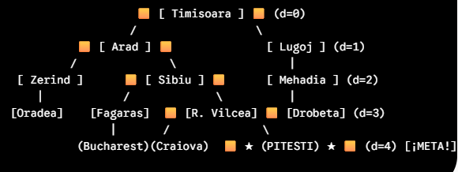
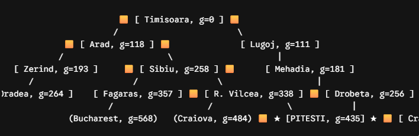
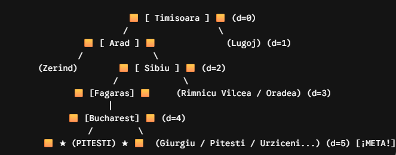
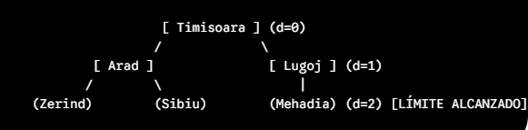
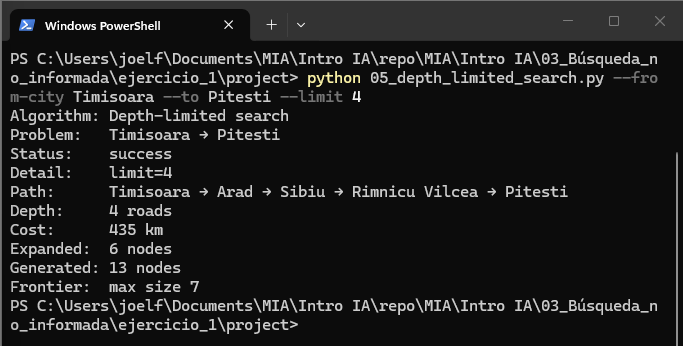
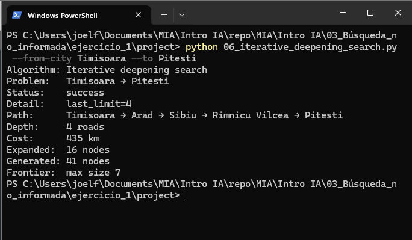
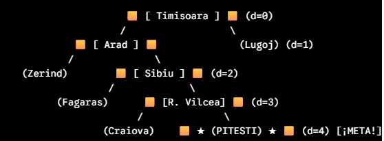

# Ejercicio 1: Búsqueda no informada 
## Joel C. Flores Escalante

***jcflores@uacam.mx***

***a26216692@alumnos.uady.mx***

### Mapa de búsqueda

## Configurar Parejas

***--from Timisoara*** 

***--to Pitesti*** 

Ejecución de mapa y existencia de la ciudad:

python 01_romania_map.py

python 01_romania_map.py --from-city Timisoara

## Tabla de resultados de cada uno de los algoritmos

| Algoritmo | Status | Depth (roads) | Cost (km) | Expanded (nodes) | Generated (nodes) | Frontier (max) | Path |
| --- | --- | --- | --- | --- | --- | --- | --- |
| BFS | success | 4 | 435 | 9 | 22 | 5 | Timisoara → Arad → Sibiu → Rimnicu Vilcea → Pitesti
| UCS | success | 4 | 435 | 11 | 28 | 4 |  Timisoara → Arad → Sibiu → Rimnicu Vilcea → Pitesti |
| DFS | sucess | 5 | 669 | 6 | 17 | 7 |  Timisoara → Arad → Sibiu → Fagaras → Bucharest → Pitesti |
| DLS limit=2 | cutoff |  |  | 3 | 8 | 5 |  |
| DLS limit=4 | success | 4 | 435 | 6 | 13 | 7 | Timisoara → Arad → Sibiu → Rimnicu Vilcea → Pitesti |
| IDS | success | 4 | 435 | 16 | 41 | 7 |  Timisoara → Arad → Sibiu → Rimnicu Vilcea → Pitesti |

### Ejecución de 02_breadth_first_search.py --from-city Timisoara --to Pitesti

### Ejecución de 03_uniform_cost_search.py --from-city Timisoara --to Pitesti

### Ejecución de 04_depth_first_search.py --from-city Timisoara --to Pitesti

### Ejecución de 05_depth_limited_search.py --from-city Timisoara --to Pitesti --limit 2

### Ejecución de 05_depth_limited_search.py --from-city Timisoara --to Pitesti --limit 4

### Ejecución de 06_iterative_deepening_search.py --from-city Timisoara --to Pitesti 

## Conclusión

Gracias Doctor. Victor, el ejercicio me hizo repasar sobre el funcionamiento y el ¿por qué? de varios sucesos con los algoritmos.

