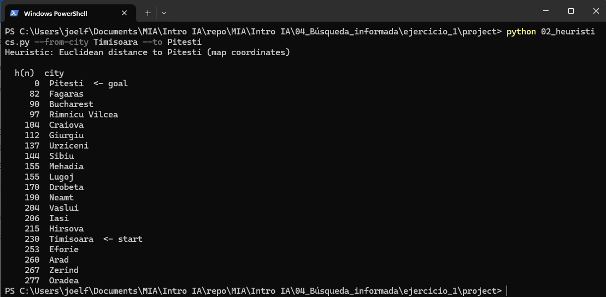
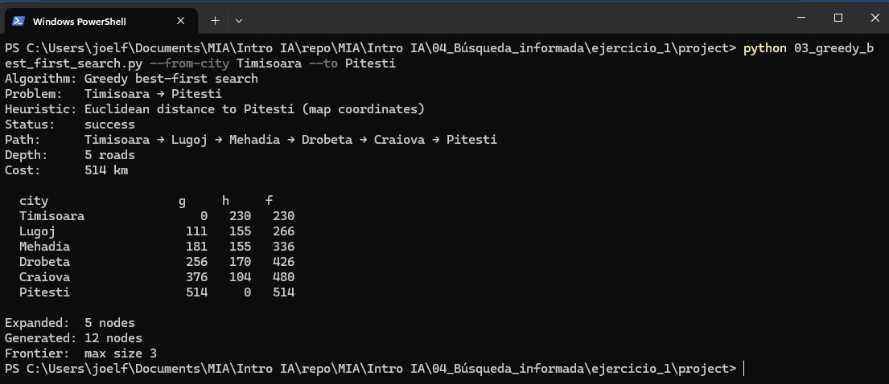
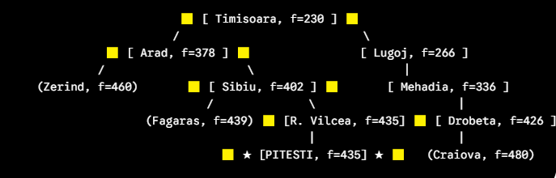

# Ejercicio 1: Búsqueda no informada 
## Joel C. Flores Escalante

***jcflores@uacam.mx***

***a26216692@alumnos.uady.mx***

### Mapa de búsqueda

## Configurar Parejas

***--from Timisoara*** 

***--to Pitesti*** 

### h(n) de la ruta. Distancia euclidiana del mapa generado por el script 02 

## Tabla de resultados de cada uno de los algoritmos

| Algoritmo | Status | Depth (roads) | Cost (km) | Expanded (nodes) | Generated (nodes) | Frontier (max) | Path |
| --- | --- | --- | --- | --- | --- | --- | --- |
| Greedy | success | 5 | 514 | 5 | 12 | 3 | Timisoara → Lugoj → Mehadia → Drobeta → Craiova → Pitesti
| A* | success | 4 | 435 | 7 | 19 | 5 |  Timisoara → Arad → Sibiu → Rimnicu Vilcea → Pitesti |

### Ejecución de python 03_greedy_best_first_search.py --from-city Timisoara --to Pitesti 

### Ejecución python 04_a_star_search.py --from-city Timisoara --to Pitesti

### Comparación nodos
 Greedy expande Lugo: Empieza en Timisoara, expande Arad y Lugo. Elige lugo por tener menor h (155 < 260)

 A* Empieza con Timisoara, expande Arad y luego, Medahia, pero al llegar Drobeta el costo es mayor que probar con Arad (378 < 426) asi que retoma la ruta de Arad. 

## Conclusión

Gracias Doctor. Victor, el ejercicio me hizo repasar sobre el funcionamiento y el ¿por qué? de varios sucesos con los algoritmos.

