# Ejercicio 1: Perceptrón multicapa 
## Joel C. Flores Escalante

***jcflores@uacam.mx***

***a26216692@alumnos.uady.mx***

## Notebook Multilayer Percetron

###Se adjunta el notebook modificado 
###4 imágenes de la primera corrida: 

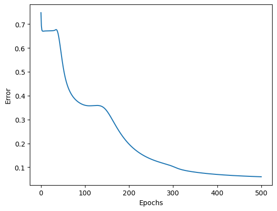

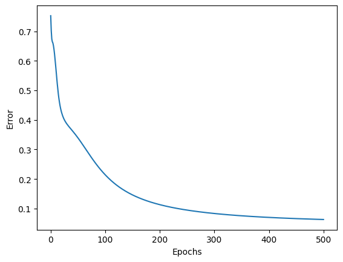

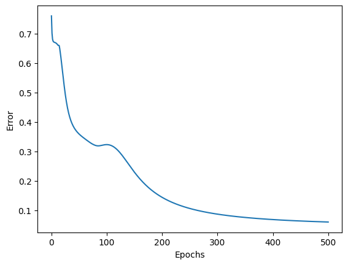

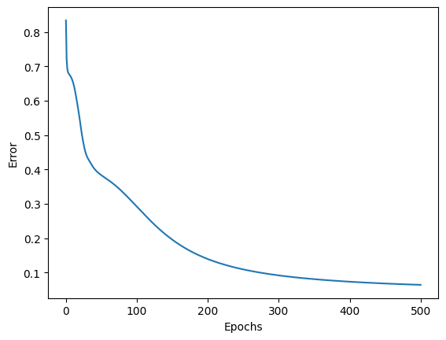

### 4 Imágenes de la corrida modificada:

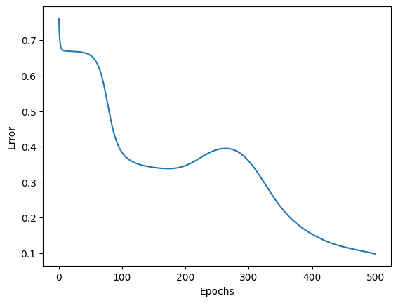

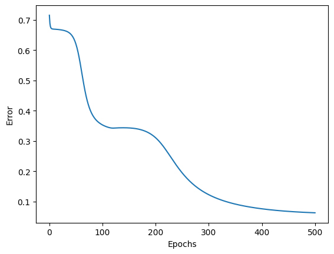

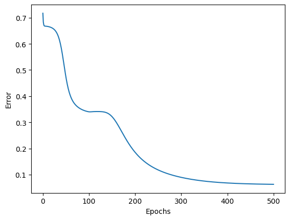

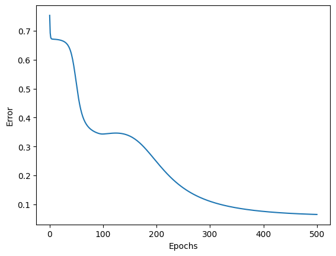

### Imagen del Colab:

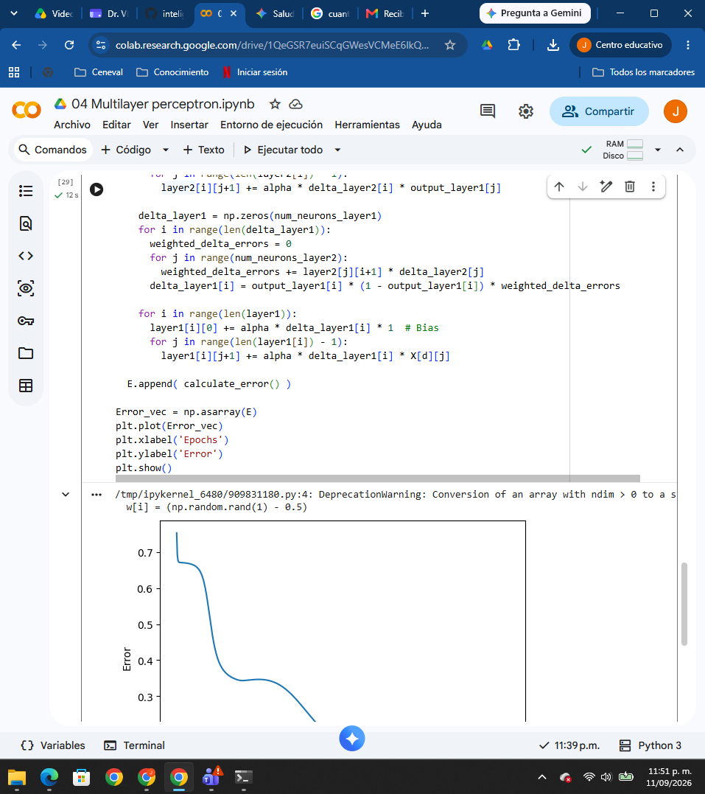

## Notebook KerAS Multilayer Percetron

###Se adjunta el notebook modificado 
### 2 imágenes de la primera corrida: 

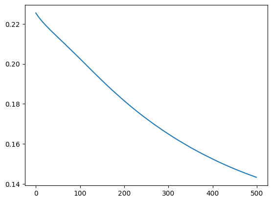

### 2 Imágenes de la corrida modificada:

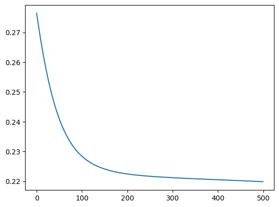

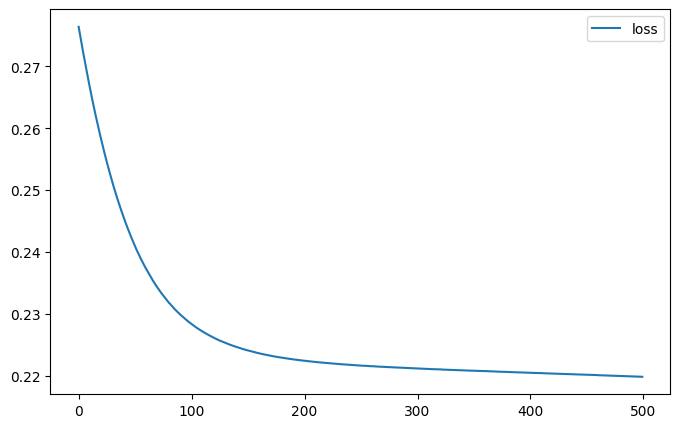

### Imagen del Colab:

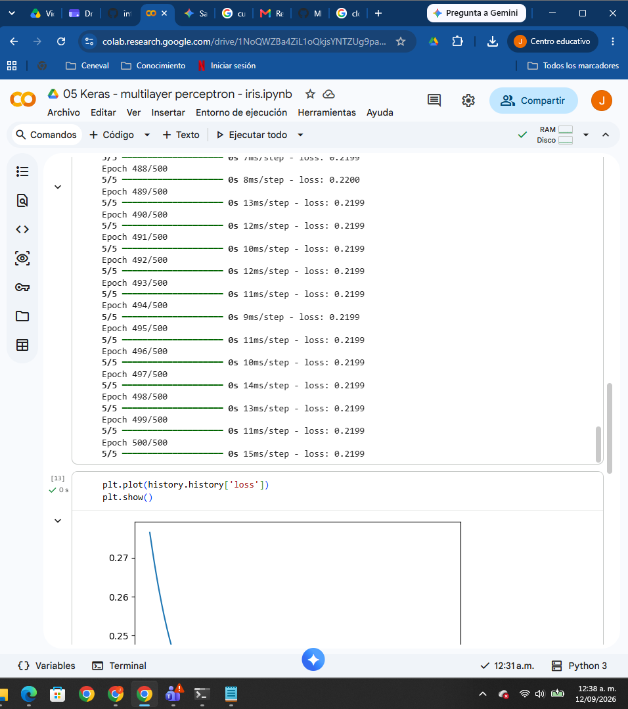

## Conclusión dadas

En keras es mucho más fácil hacer la adaptación de una nueva capa, sin embargo todo el proceso de aprendizaje y ver como se va haciendo los cálculos se entiende más en el percertron sin API.

