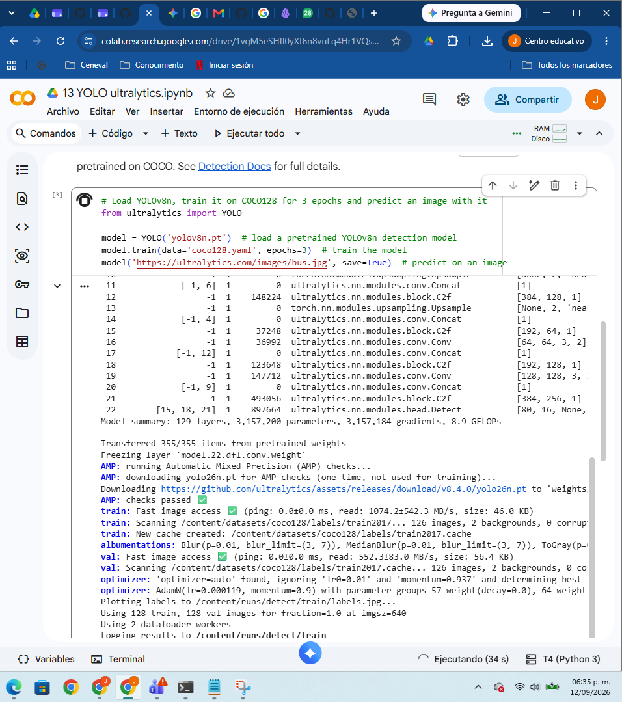
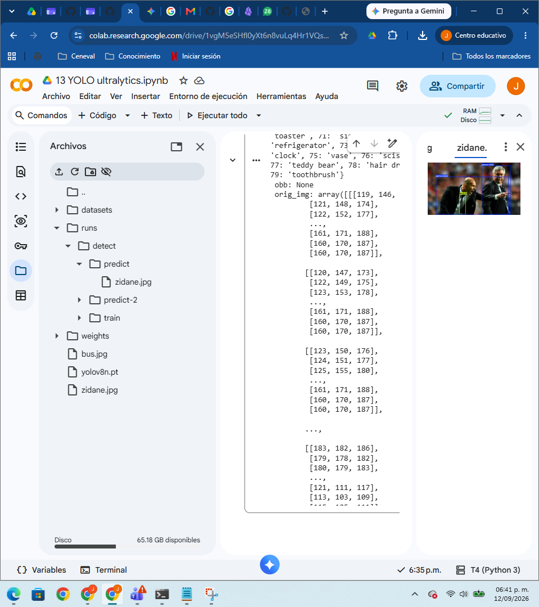
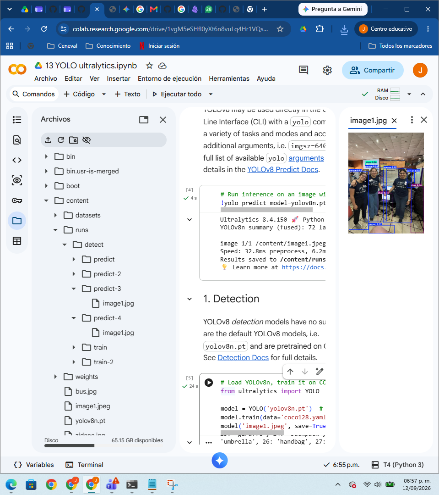
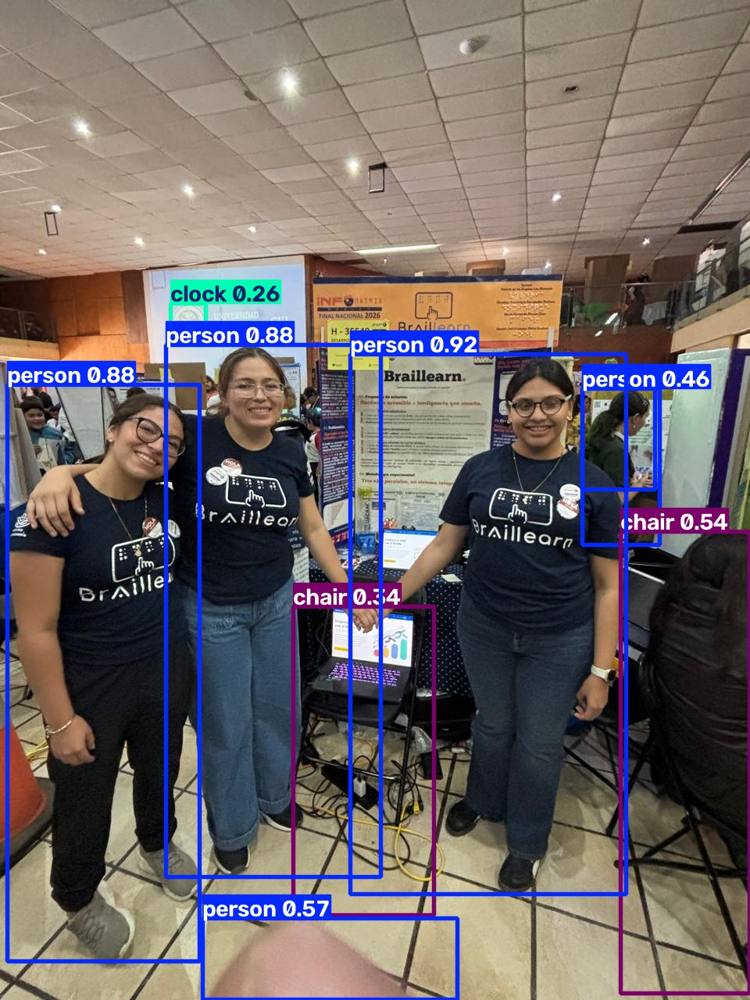

# Ejercicio 1: Perceptrón multicapa

## Joel C. Flores Escalante

***jcflores@uacam.mx***

***a26216692@alumnos.uady.mx***

## Notebook Keras

## Se adjunta imagenes de la primera corrida 

### Imágenes de la corrida modificada:

## Conclusión

Yolo y CoCo son dos herramientas bastante útiles y configurables para Visión Artificial. Con las indicaciones de la tarea, el código de la Notebook se pudo realizar la tarea sin problemas.

Nota: Esta tarea ya se había hecho en tiempo y forma, pero al revisar mi Git me di cuenta que algo pasó y se no estaba bien el archivo tuve que volver a hacerlo y aproveche para ponerle nombre de README. 

